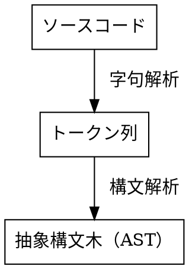

## Chapter 1 字句解析

字句解析
: ソースコードからトークン列への変換処理


字句解析の例

入力が`let x = 5 + 5;` のとき、出力（一例）は
```
[
    LET,
    INDENTIFIER("x");
    EQUAL_SIGN,
    INTEGER(5),
    PLUS_SIGN,
    INTEGER(5),
    SEMICOLON
]
```

字句解析器の


トークンの定義

```
let five = 5;
let ten = 10;

let add = fn(x, y) {
    x + y;
};

let result = add(five, ten);
```
を字句解析するとする。

このとき必要なトークンの種類は
- 識別子（変数名）<br>
    ( x, y, add, result )
- キーワード（予約語$^1$、識別子として利用できない文字列）<br>
    ( let, fn )
- 記号<br>
    (「 ( 」,「 ) 」,「 { 」,「 } 」,「 = 」,「 , 」,「 ; 」)
- データ構造
    - データ型（データの種類）
    - リテラル値（データの実際の値）

1 [一応厳密にはキーワードと予約語は違う概念らしい](https://ja.wikipedia.org/wiki/予約語)


字句解析器（lexer：レキサー）

手順
1. 受け取った入力（ソースコード）を先頭から読み取る
2. トークン・文字ごとに認識
3. １つずつ順に出力する


関数

`monkey/lexer/lexer.go` の解説


{token., ""},


## Chapter 2 構文解析


## Chapter 3 評価


## Chapter 4 インタプリタの拡張

