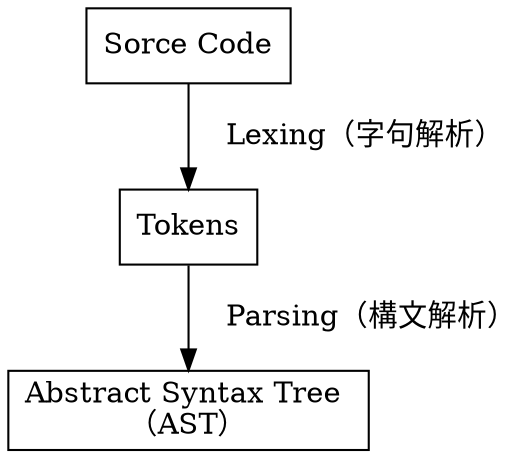
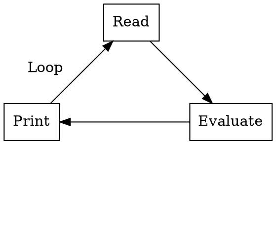
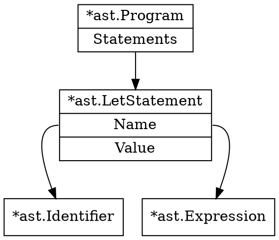

## Chapter 1 字句解析

字句解析
: ソースコードからトークン列への変換処理


字句解析の例

入力が`let x = 5 + 5;` のとき、出力（一例）は
```
[
    LET,
    INDENTIFIER("x");
    EQUAL_SIGN,
    INTEGER(5),
    PLUS_SIGN,
    INTEGER(5),
    SEMICOLON
]
```

字句解析器の


トークンの定義

```
let five = 5;
let ten = 10;

let add = fn(x, y) {
    x + y;
};

let result = add(five, ten);
```
を字句解析するとする。

このとき必要なトークンの種類は
- 識別子（変数名）<br>
    ( x, y, add, result )
- キーワード（予約語 $^1$、識別子として利用できない文字列）<br>
    ( let, fn )
- 記号<br>
    (「 ( 」,「 ) 」,「 { 」,「 } 」,「 = 」,「 , 」,「 ; 」)
- データ構造
    - データ型（データの種類）
    - リテラル値（データの実際の値）

1 [一応厳密にはキーワードと予約語は違う概念らしい](https://ja.wikipedia.org/wiki/予約語)


関数の説明（まとめ）
（元気がある時にやっておいてください）


#### `monkey/token/token.go`

`LookupIdent()`
文字列がキーワードか識別子か判定してデータ型を返す


#### `monkey/lexer/lexer.go`

`New()`

l ( := Lexer ) の中の
- l.ch
- l.postion
- l.readPostion
を初期化する

`readChar()`

次の文字（`readPostion`にある文字）を読み込んで`l.ch`に代入する関数

`l.ch = 0`：ASCIIでNULL = EOF


`NextToken()`

`l.ch` にある文字をチェックして当てはまる型とその文字（リテラル）を返す


`isLetter()`
`l.ch`の文字が`[a-zA-Z_]`かどうか判定する

`readIdentifier()`

`isLetter()`が`False` ( = `l.ch`の文字が`[a-zA-Z_]` でない) になるまで`readChar`で読み進め、入力された文字からそれより前の文字までの文字列を返す

`skipWhitespace()`

`l.ch` が
- スペース
- タブ
- 改行
- 復帰（行頭に移動）

の場合、無視して読み進める

`isDigit()`
`l.ch`の文字が`[0-9]`（一文字の数字）かどうか判定する

`readNumber()`

`isDigit()`が`False` ( = `l.ch`の文字が`[0-9]` でない) になるまで`readChar`で読み進め、入力された文字からそれより前の文字までの文字列を返す


#### `monkey/lexer/lexer_test.go`

### lexer の拡張（1.4）

### Start of  a REPL

REPL (**Read-Eval-Print Loop**)


プログラミング言語の実行環境の１つで、ユーザが１行（１つ以上の式）の入力すると、インタプリタが
1. 読み取り
2. 評価（実行）
3. 次の行に結果を表示
4. 再び入力可能状態に戻る

する対話的な環境。
コンソール、インタラクティブモードの呼び方のがわかりやすい


## Chapter 2 構文解析

トップダウン構文解析

ボトムダウン構文解析


`let <identifier> = <expression>`

- Expressions: 式
- Statements: 文

`let x = 5;`




## Chapter 3 評価


## Chapter 4 インタプリタの拡張

