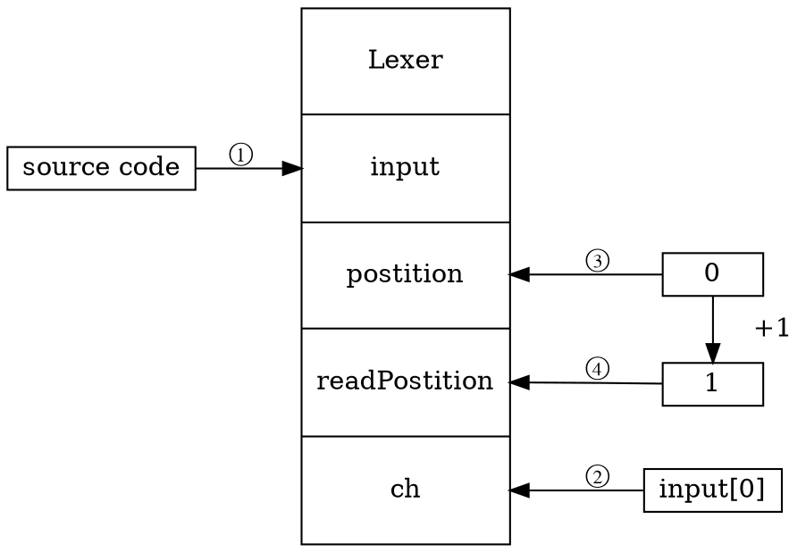
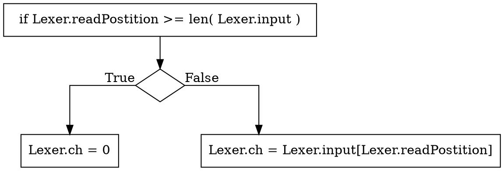
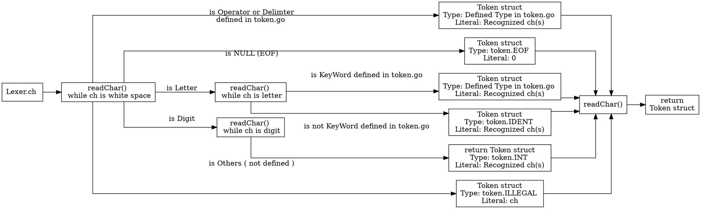

### Chapter 1 Lexser

```
monkey/
├── main.go
├── go.mod
├── lexer
│   ├── lexer.go
│   └── lexer_test.go
├── repl
│   └── repl.go
└── token
    └── token.go
```

#### Define tokenType ( token.go )

##### 定義したTokenType (のカテゴリ)
- 未定義文字（ILLEGAL）
- ファイル終端文字（EOF）
- 演算子
- 区切り文字
- 識別子
- キーワード
- データ型（INTとか）

##### `Token` 構造体
```
type Token struct {
    Type    TokenType
    Literal string
}
```
- 上で定義したTokenType
- その実際の中身

を格納する構造体

- 例１：`5` → `{Type: INT, Literal: "5"}`
- 例２：`let` → `{Type: LET, Literal: "let"}`

##### `LookupIdent`　関数

- 入力：文字列
- 出力：Tokentype

入力がキーワードかどうかを判定し、
- キーワードのとき → return その Tokentype
- else → return IDENT Tokentype


#### Initialization ( New method in token.go )

##### `Lexer` 構造体
||格納するデータ|データ型|初期値|
|:---:|:---:|:---:|:---:|
|input|入力されたソースコードそのもの| string | "" |
|postition|現在の文字の位置| int| 0|
|readPostition|次に読み取る文字の位置|int|0|
|ch|現在の文字<br>（inputの中のpostitionにある文字）|byte|0|


##### `readChar` method in token.go
- `Lexer`構図体に対して、現在読み込んでいる文字の次の文字とその位置を取得するメソッド
- 初期化では上図の ②〜④ を行う
- （ ① のinputへの代入は初期化メソッド `New` が行い、`New` のなかで `readChar` が呼び出される）

###### ２.　現在の文字`ch` の更新


- `readPostition >= len(input)` 、つまり次の文字の位置が入力文字数と等しい（入力の最後の文字が必ず終端文字なら`==`でいいんだろうが）とき、`Lexer.ch` に `0` を格納する
- そうでないとき、文字列 `input` の `readPostition` にある文字を `Lexer.ch` に格納する
- 初期化のときは、`postition == readPostition == 0` なので　`Lexer.ch` には最初の文字が格納される

###### ３. 現在の文字位置 `postition` を更新　→ `postition = readPostition`
- つまり 2. で現在の文字 `ch` を更新したので、その位置の値を `postition` に格納
- 初期化のときはどっちにしろ0なので何も変わらない

###### 4. 次の文字位置 `readPostition` を更新 → `Postition += 1`
- つまり、次の文字の値をインクリメントする
- 初期化のときは +1 で input の２文字目を指す
- monkey が想定している文字コードは ASCII のみなので、Unicode とか使いたくなったら +1 じゃダメかも


#### `NewToken` method in token.go


細かい補助関数はいっぱいあるけど流れはこれ

1. 空白を除く
2. 入力文字が
   - 演算子か
   - 区切り文字か
   - EOFか   
   - 文字か
   - 数字か
   - 未定義か
    
    で場合分け
3. 複数文字で1つの型として扱いうるもの（変数名とか数字とか`==`とか）は各々対処
3. 2, 3 で得た結果を構造体 `Token` に格納してreturn


#### Chapter 1 まとめ
- Chapter 1 は `readChar` と `NewToken` が何をやってるかちゃんとわかれば大丈夫だと思う

### Chapter 2 Parser


